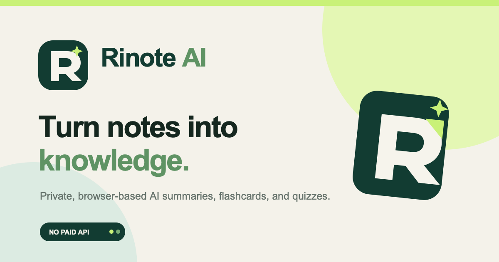

<p align="center">
  
</p>

<h1 align="center">Rinote AI</h1>

<p align="center">
  <strong>Turn notes into knowledge.</strong><br>
  A privacy-first AI study assistant that runs entirely in your browser.
</p>



## Overview

Rinote AI helps students turn class notes into clear summaries, editable flashcards, and interactive quizzes. It is free, requires no account, and keeps notes on the user’s device.

## What You Can Do

- Paste notes or import a `.txt` file
- Generate an AI summary and important topics
- Study with editable flashcards and mastery tracking
- Take automatically generated quizzes
- Save and reopen previous study sessions
- Print summaries and flashcards or save them as PDFs
- Use the app on desktop or mobile, including dark mode

## Using Rinote

1. Add a course name and paste or import your notes.
2. Keep **Browser AI** enabled and select **Generate study kit**.
3. Review your summary, practice the flashcards, and complete the quiz.

The first AI generation may take longer while the browser downloads the model. Later sessions use the cached model.

## Privacy

Notes are processed locally and are never submitted to an external AI API. Study history stays in the browser and can be permanently deleted at any time.

## For Developers

Rinote uses a quantized DistilBART transformer through Transformers.js and ONNX Runtime. Lightweight natural-language processing provides topic extraction, flashcard creation, quiz generation, and an automatic fallback when the AI model is unavailable.

**Built with:** `JavaScript` · `HTML` · `CSS` · `Transformers.js` · `ONNX Runtime` · `DistilBART`

### Run Locally

```bash
git clone <your-repository-url>
cd rinote-ai
python3 -m http.server 8000
```

Open [http://localhost:8000](http://localhost:8000).

## Roadmap

- Spaced-repetition scheduling
- Lightweight model option for slower devices
- Web Worker inference

---

<p align="center">Designed and developed as an independent AI portfolio project.</p>
